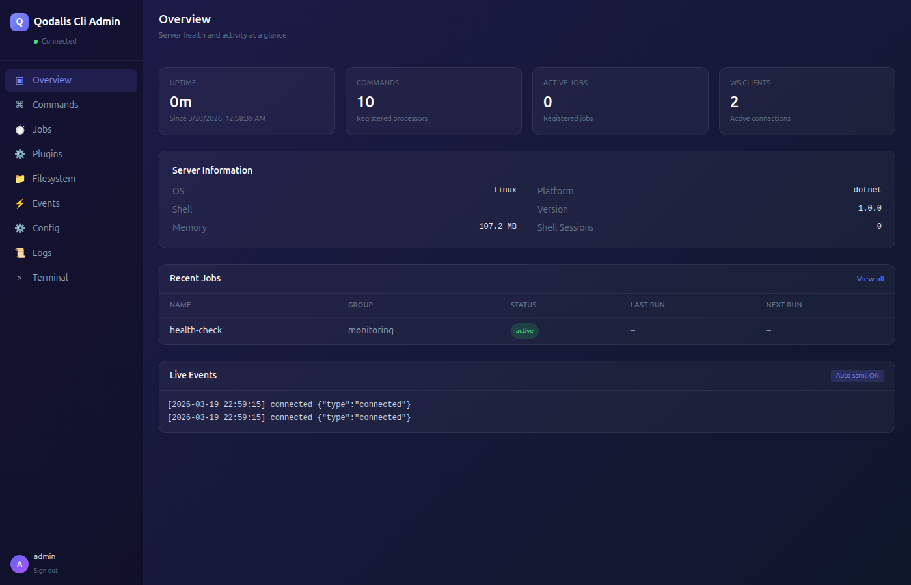

# Qodalis CLI Server Dashboard

The admin dashboard for Qodalis CLI servers: a React single-page app that each server's admin plugin serves at `/qcli/admin`.

[](https://www.npmjs.com/package/@qodalis/cli-server-dashboard)
[](https://github.com/qodalis-solutions/cli-server-dashboard/actions/workflows/build.yml)



## What it is

You do not run the dashboard on its own. It ships as the npm package `@qodalis/cli-server-dashboard` (static files in
`dist/`), and the admin plugin of each Qodalis CLI server copies those files and serves them next to its API.

| Repository | Role |
| --- | --- |
| [web-cli](https://github.com/qodalis-solutions/web-cli) | The browser terminal engine with Angular, React and Vue wrappers and plugins. The dashboard's Terminal page uses `@qodalis/react-cli`. |
| [cli-server-node](https://github.com/qodalis-solutions/cli-server-node), [cli-server-dotnet](https://github.com/qodalis-solutions/cli-server-dotnet), [cli-server-python](https://github.com/qodalis-solutions/cli-server-python) | The servers. Their admin plugins serve this dashboard and its API. |
| **cli-server-dashboard** | This repository. |
| [mcp-cli](https://github.com/qodalis-solutions/mcp-cli) | Local MCP server that connects Claude Code to a CLI server. |
| [pwa-cli](https://github.com/qodalis-solutions/pwa-cli) | The CLI as an installable PWA and Android app. |

## Pages

| Page | Contents |
| --- | --- |
| Overview | Server health, uptime, enabled features; memory, CPU and WebSocket clients over time; needs attention (failing jobs, latest errors); job runs over the last 24 hours |
| Commands | Registered command processors; the most used commands since start with their failures, sorting by use or failures |
| Plugins | Server plugins the host installed (package, version, description), and the command modules with their commands; enable or disable a module |
| Terminal | Embedded CLI terminal signed in with the dashboard session (when the server enables the shell); with the users plugin its user is the signed-in user (prompt, `whoami`) |
| Jobs | Background jobs: search and filters (status, group, time range), run statistics, runs-over-time and duration charts, recent runs across jobs, status, history (filtered by result) with each run's own values (`properties`), edit a job, cancel a run, delete runs (one, a result's or every finished one), trigger, pause, resume, stop (when the server has the jobs plugin); only the actions a job offers (`actions`) are shown |
| Filesystem | Browse, upload, download and delete files (when the server enables the filesystem API); the folder is kept in the URL |
| Audit | The users plugin's audit log: who did what to whom or what, with the host's own values; activity chart, most frequent events and users, filter by event, actor, user, text and time range, CSV export (when the server has the audit plugin) |
| Events | Live WebSocket event stream (filter by type or text, pause) and connected clients |
| Config | Server configuration sections; mutable settings can be changed |
| Logs | Server logs with level, text, service and time filters, a log volume chart by level, older entries loaded when scrolling up, pause, jump to newest, copy an entry, collapsed exceptions |

Every page keeps its filters in the URL, tables sort by their headers, and **Ctrl+K** (⌘K on a Mac) opens a
command palette to jump to a page, a job or a command, or to search the jobs, logs or audit log. The charts use the
servers' statistics endpoints (`/jobs/stats`, `/logs/histogram`, `/status/history`, `/commands/stats`, servers since
1.0.0-beta.19); with older servers the dashboard counts what it loads, samples the status itself, or leaves the chart
out.

A failing page or panel shows its error in place, with **Retry**, instead of taking down the whole dashboard.

Terminal, Jobs, Filesystem and Audit appear only when the server provides them: the shell from
`GET /api/v1/qcli/capabilities` (`shell: true`), jobs, filesystem and audit from the admin status (`enabledFeatures`), or,
on servers whose status has no `enabledFeatures`, from the plugin list (`/plugins`). They are left out of the
sidebar, and a direct link to one of them shows "Not enabled on this server" instead of a page that would fail.

The dashboard keeps **one** events WebSocket for the whole session (not one per page). When it drops, it reconnects
after 1 s, 2 s, 4 s … up to 30 s; the delay starts over once a connection has stayed up for 10 seconds.

## Enabling it on a server

Each admin plugin mounts the API under `/api/v1/qcli` and the dashboard under `/qcli/admin`.

**Node.js** (`@qodalis/cli-server-plugin-admin`)

```typescript
import { createCliServer } from '@qodalis/cli-server-node';
import { CliAdminBuilder } from '@qodalis/cli-server-plugin-admin';

const { registry, builder, executor, eventSocketManager, mountPlugin } = createCliServer({ /* ... */ });

const adminPlugin = new CliAdminBuilder()
    .setCredentials('admin', 'a-strong-password') // or .setAuthProvider(usersPlugin.serverAuth)
    .build({ registry, eventSocketManager, builder, executor });

mountPlugin(adminPlugin);
```

**.NET** (`Qodalis.Cli.Plugin.Admin`)

```csharp
builder.Services.AddCli(cli =>
{
    cli.AddAdmin();
});

// After UseWebSockets() and before MapControllers()
app.UseQodalisAdmin();
```

**Python** (`qodalis-cli-server-plugin-admin`)

```python
from qodalis_cli_admin import AdminBuildDeps, CliAdminBuilder

admin_plugin = (
    CliAdminBuilder()
    .set_credentials("admin", "a-strong-password")  # or .set_users_plugin(users_plugin)
    .build(AdminBuildDeps(
        registry=result.registry,
        event_socket_manager=result.event_socket_manager,
        builder=result.builder,
    ))
)
result.mount_plugin(admin_plugin)
```

Then open `http://<server>/qcli/admin`. See each server's admin plugin README for every option.

### Sign-in

| Server setup | How you sign in |
| --- | --- |
| With the users plugin (protected server) | A server account with the `admin:access` permission. Members of `admin` have it; grant it to another group with `groupmod ops --grant=admin:access`. |
| Without the users plugin | The admin plugin's own credentials, set in code or through the variables below. |
| Users plugin with an external auth adapter (`UseExternalAuth`) | The host application's own sign-in, see [Sign in with the host app's session](#sign-in-with-the-host-apps-session). The password form is not shown. |

| Variable | Default | Purpose |
| --- | --- | --- |
| `QCLI_ADMIN_USERNAME` | `admin` | Admin user name |
| `QCLI_ADMIN_PASSWORD` | `admin` | Admin password |
| `QCLI_ADMIN_JWT_SECRET` | random per start | Secret that signs dashboard tokens |

The servers log a warning at startup while the default credentials are in use. Change them for anything that is not a
local test.

On startup the dashboard asks `GET /api/v1/qcli/auth/mode` which sign-in to show. Servers without that endpoint
(404) or that can't be reached are treated as `password`.

### Sign in with the host app's session

When the server's users plugin delegates authentication to your application, `/auth/mode` answers
`{ "mode": "external", "signInUrl": "…" }` and the dashboard:

- shows **Sign in at `<signInUrl>`** with a **Retry** button instead of the username/password form (or, without a
  `signInUrl`, tells users to sign in through the host application);
- goes to that screen on any 401 (an expired host token, for example);
- never sends or advertises the static `QCLI_ADMIN_USERNAME`/`QCLI_ADMIN_PASSWORD`: the server answers its login
  endpoint with 501 in this mode.

**Handoff.** The host opens the dashboard with its bearer token in the URL fragment:

```ts
// In the host app, for a signed-in admin
window.location.href = `/qcli/admin/#token=${encodeURIComponent(accessToken)}`;
```

A fragment is never sent to servers or written to their logs. On startup the dashboard reads `#token=`, stores it as
its admin token (`localStorage['qcli_admin_token']`), removes it from the address bar with `history.replaceState`
(other fragment parameters are kept) and sends it as `Authorization: Bearer …` on every API call. The server's
external auth adapter validates it like any other request from the host. If the host's adapter authenticates with
its own cookie instead, the dashboard needs no handoff: **Retry** checks the session again.

Server side, set the sign-in page with the admin plugin's `SignInUrl` option (.NET:
`AddAdmin(o => o.SignInUrl = "https://app.example.com/sign-in")`): an absolute http(s) URL or a root-relative path.

### Security

- On protected servers the dashboard token is a server session: **Sign out** ends it
  (`DELETE /api/v1/qcli/sessions/current`), and revoking the session elsewhere (`session-kick`, disabling the user)
  signs the dashboard out on its next request.
- WebSocket connections (events, terminal) on protected servers never put the token in the URL. Each connection
  first gets a single-use ticket from `POST /api/v1/qcli/sessions/ws-ticket`. Servers without the users plugin still
  accept `?token=`.
- The dashboard is served from the server's own origin, so no CORS configuration is needed.
- `ssh` from the embedded terminal follows the server's remote shell policy; see the server READMEs.

## Color scheme

Every color in the dashboard is a token, so you can match the dashboard to your own design. Set the scheme in the
admin plugin's options on the server; the same option shape works on all three servers.

```jsonc
{
  "mode": "system",              // "dark" (default), "light", or "system" to follow the browser
  "light": { "primary": "#2a6bba", "background": "#f1f6fa" },  // any subset of the tokens below
  "dark":  { "primary": "#4f9be0", "background": "#0d1823" }
}
```

**Node.js**

```typescript
const adminPlugin = new CliAdminBuilder()
    .setTheme({
        mode: 'system',
        light: { primary: '#2a6bba', primaryHover: '#1f5596', accent: '#2a6bba', background: '#f1f6fa',
                 backgroundAccent: '#f1f6fa', surface: '#ffffff', border: '#d9e3ec', text: '#142231', muted: '#5d6f82' },
        dark: { primary: '#4f9be0', primaryHover: '#3f8ad3', onPrimary: '#0d1823', accent: '#4f9be0',
                background: '#0d1823', backgroundAccent: '#0d1823', surface: '#13212f', border: '#22364a',
                text: '#e6eef6', muted: '#93a6b9' },
    })
    .build({ registry, eventSocketManager, builder, executor });
```

**.NET**

```csharp
cli.AddAdmin(o =>
{
    o.Theme.Mode = AdminThemeMode.System;
    o.Theme.Light = new AdminThemeColors { Primary = "#2a6bba", Background = "#f1f6fa", Text = "#142231" };
    o.Theme.Dark = new AdminThemeColors { Primary = "#4f9be0", Background = "#0d1823", Surface = "#13212f" };
});
```

**Python**

```python
admin_plugin = (
    CliAdminBuilder()
    .set_theme({
        "mode": "system",
        "light": {"primary": "#2a6bba", "background": "#f1f6fa", "text": "#142231"},
        "dark": {"primary": "#4f9be0", "background": "#0d1823", "surface": "#13212f"},
    })
    .build(deps)
)
```

Python also accepts snake_case token keys (`primary_hover`).

Each value must be a plain CSS color: hex (`#rgb`, `#rgba`, `#rrggbb`, `#rrggbbaa`), a color function with numeric
arguments (`rgb()`, `rgba()`, `hsl()`, `hsla()`, `hwb()`, `lab()`, `lch()`, `oklab()`, `oklch()`) or a named color
(`white`, `transparent`). The server rejects anything else at startup (an unknown mode or token, `var()`, `url()`,
`;` and the like), so a theme cannot inject CSS. Translucent values work: the default dark surfaces are white at a few
percent opacity over the background.

How it reaches the dashboard: the server publishes the validated scheme at `GET /qcli/admin/theme.json` (public, like
the dashboard files, because the sign-in page uses it too), for example
`{"mode":"light","dark":{},"light":{"primary":"#2a6bba"}}`. The dashboard loads it before its first render and
writes the tokens as CSS custom properties on `:root`. Tokens you leave out, a missing file or an invalid value keep the
defaults below. The page shows the dark or light set according to `mode`; with `system` it follows the browser's
`prefers-color-scheme` and switches live.

The defaults match the Qodalis CLI panel: its grays, indigo accent with the violet glow, and status colors in dark; the same palette for light backgrounds in light.

| Token | CSS variable | Used for | Dark default | Light default |
| --- | --- | --- | --- | --- |
| `primary` | `--qcli-primary` | Primary buttons, active navigation, toggles, focus rings | `#818cf8` | `#4f46e5` |
| `primaryHover` | `--qcli-primary-hover` | Primary buttons on hover | `#a5b4fc` | `#4338ca` |
| `onPrimary` | `--qcli-on-primary` | Text and icons on `primary` | `#111827` | `#ffffff` |
| `accent` | `--qcli-accent` | Highlighted text: links, command names, active items | `#a78bfa` | `#7c3aed` |
| `background` | `--qcli-background` | Page background | `#111827` | `#f9fafb` |
| `backgroundAccent` | `--qcli-background-accent` | Start of the page background gradient (set it to `background` for a flat page) | `#1f2937` | `#eef2ff` |
| `sidebar` | `--qcli-sidebar` | Sidebar background | `#1f2937` | `#ffffff` |
| `surface` | `--qcli-surface` | Cards, panels and tables | `rgba(255, 255, 255, 0.04)` | `#ffffff` |
| `popover` | `--qcli-popover` | Dialogs and dropdown menus (opaque) | `#1f2937` | `#ffffff` |
| `control` | `--qcli-control` | Inputs, secondary buttons, chips | `rgba(255, 255, 255, 0.06)` | `rgba(17, 24, 39, 0.05)` |
| `controlHover` | `--qcli-control-hover` | Inputs and secondary buttons on hover | `rgba(255, 255, 255, 0.1)` | `rgba(17, 24, 39, 0.1)` |
| `border` | `--qcli-border` | Borders and dividers | `#374151` | `#e5e7eb` |
| `overlay` | `--qcli-overlay` | Backdrop behind dialogs | `rgba(0, 0, 0, 0.6)` | `rgba(17, 24, 39, 0.45)` |
| `heading` | `--qcli-heading` | Headings and values | `#ffffff` | `#111827` |
| `text` | `--qcli-text` | Body text | `rgba(255, 255, 255, 0.87)` | `#1f2937` |
| `muted` | `--qcli-muted` | Secondary text and labels | `rgba(255, 255, 255, 0.6)` | `#4b5563` |
| `subtle` | `--qcli-subtle` | Hints, placeholders, timestamps | `rgba(255, 255, 255, 0.4)` | `#6b7280` |
| `success` | `--qcli-success` | Success states | `#3fb950` | `#1a7f37` |
| `warning` | `--qcli-warning` | Warning states | `#f0883e` | `#bc4c00` |
| `error` | `--qcli-error` | Errors and destructive actions | `#f85149` | `#cf222e` |
| `info` | `--qcli-info` | Informational states | `#58a6ff` | `#0969da` |

The embedded terminal keeps the CLI's own terminal theme (change it there with the `theme` command).

## Name and icon

By default the dashboard is "Qodalis Cli Admin" with the Qodalis Solutions logo (`public/qodalis-icon.svg`). An
application that ships it under its own name sets the admin plugin's branding: the name and icon of the browser tab,
the sidebar and the sign-in page, and the name its terminal shows in the welcome banner.

```csharp
cli.AddAdmin(o => { o.Branding.Name = "RateBell"; o.Branding.IconUrl = "/favicon.svg"; o.Branding.CliName = "RateBell CLI"; });
```

```ts
new CliAdminBuilder().setBranding({ name: 'RateBell', iconUrl: '/favicon.svg', cliName: 'RateBell CLI' });
```

```python
CliAdminBuilder().set_branding({"name": "RateBell", "icon_url": "/favicon.svg", "cli_name": "RateBell CLI"})
```

The icon is an absolute http(s) URL, a root-relative path or a base64 `data:image` URL; the servers validate the
values at startup. They reach the dashboard as `branding` in `theme.json`
(`{ "name": "RateBell", "icon": "/favicon.svg", "cli": { "name": "RateBell CLI" } }`), read before the first render;
the dashboard drops anything malformed and falls back to the Qodalis logo when a custom icon fails to load. The
terminal's copyright line, docs link and `version` stay Qodalis CLI's (`version` adds the name).

### Using the tokens in the dashboard code

The tokens live in `src/theme/tokens.ts` and Tailwind exposes each one as a color (`bg-primary`, `text-muted`,
`border-border`, `bg-error/10`); opacity modifiers work with any color format. The stock Tailwind palette is turned
off, and `npm test` fails on a stock color class (`text-slate-400`) or a literal color in a component, so new UI stays
themeable.

## Admin API

The admin plugins expose these endpoints under `/api/v1/qcli`. Everything except `/auth/mode` and login requires a
token.

| Endpoint | Method | Purpose |
| --- | --- | --- |
| `/auth/mode` | GET | Which sign-in to show: `{ "mode": "password" \| "external", "signInUrl": string \| null }` |
| `/auth/login` | POST | Sign in, returns a token (501 with `code: "EXTERNAL_AUTH"` in external mode) |
| `/auth/me` | GET | Current user |
| `/status` | GET | Health, uptime, memory, connections, features |
| `/config` | GET, PUT | Read configuration sections, update mutable settings |
| `/plugins` | GET | Registered modules and their processors |
| `/plugins/:id/toggle` | POST | Enable or disable a module |
| `/logs` | GET | Query logs (`level`, `search`, `limit`, `offset`) |
| `/ws/clients` | GET | Connected WebSocket clients |

The other pages use the standard server API (`/api/v1/qcli/commands`, `/api/v1/qcli/jobs`, `/api/qcli/fs/*`,
`/api/v1/qcli/capabilities`, `/ws/v1/qcli/events`).

## Languages

English, Español, Français, Deutsch, Português, Italiano, 日本語, 한국어, 中文 and Русский. The dashboard starts in the
browser's language (English otherwise); the picker under **Sign out** changes it and the choice is remembered per
browser. Dates, numbers and relative times follow the language, and the embedded terminal switches too through the CLI
language packs (`@qodalis/cli-lang-*`).

To add or change text:

- Messages live in `src/i18n/messages/<area>.ts`, one file per page with all languages side by side. English is the
  source; a missing translation falls back to English.
- Read them with `const { t } = useI18n()` and `t('jobs.title')`. Keys are type-checked, so a typo fails the build.
- Placeholders: `'{count} entries shown'` with `t('logs.shown', { count })`. Plurals: define `key_one` and `key_other`
  (plus `key_few` / `key_many` where the language needs them) and pass `count`.
- Dates and numbers: `formatDate`, `formatRelative` and `formatNumber` from the same hook.
- A new language goes into `src/i18n/locales.ts` and gets a block in each message file.

## Development

CI builds with Node.js 22.

| Command | What it does |
| --- | --- |
| `npm install` | Install dependencies |
| `npm run dev` | Vite dev server; proxies `/api`, `/ws` and `/qcli/admin/theme.json` to `http://localhost:8047` (Node server) |
| `npm run dev:node` / `dev:dotnet` / `dev:python` | Dev server proxied to port 8047 / 8046 / 8048 |
| `npm run build` | Type-check and build into `dist/` |
| `npm test` | Tests (Vitest, jsdom): theme parsing and validation, the check that components use only theme tokens, sign-in modes and the `#token=` handoff, the events socket and its backoff, feature gating |
| `npm run lint` | ESLint |
| `npm run preview` | Serve the production build |

Any other target works with `VITE_PROXY_TARGET=http://host:port npm run dev`. The app is built for the base path
`/qcli/admin/`.

`dev` and `build` first copy the CLI's optional WebAssembly module from `node_modules/@qodalis/cli` into
`public/assets/wasm/` (`scripts/copy-wasm.mjs`, git-ignored). Without it the terminal falls back to JavaScript.

### How the servers pick up the dashboard

Each admin plugin copies the dashboard at build time. It prefers a sibling checkout of this repository
(`../cli-server-dashboard/dist`, so run `npm run build` here first) and otherwise uses the published npm package.

| Server | Copied by | Served from |
| --- | --- | --- |
| Node.js | `npm run build` in `plugins/admin` (`prebuild` runs `scripts/copy-dashboard.js`) | `plugins/admin/dashboard/` |
| Python | `python scripts/copy_dashboard.py` in `plugins/admin`; also resolved at runtime from `node_modules` or the sibling checkout | `plugins/admin/qodalis_cli_admin/dashboard/` |
| .NET | `dotnet build` of `Qodalis.Cli.Plugin.Admin` (runs `npm install` itself when neither source exists) | Embedded in the plugin assembly (staged in `wwwroot/admin/`) |

The servers' Docker images install the npm package, so they ship the published version. After publishing a new
dashboard, refresh the admin plugins' lockfiles.

## Releases

Pull requests go into `develop`; CI (`build.yml`) runs `npm ci`, `npm run lint`, `npm test` and `npm run build`. A push to `main` publishes the
`package.json` version to npm (`publish.yml`), skipping versions that already exist.

## Tech stack

React 18, TypeScript, Vite, Tailwind CSS, React Router, `@qodalis/react-cli`.
